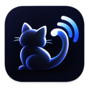

<div align="center">
  
  <h1>tailcast</h1>
  <p>
    <a href="https://www.npmjs.com/package/@thoth-dev/tailcast"></a>
    <a href="https://www.npmjs.com/package/@thoth-dev/tailcast"></a>
  </p>
</div>

Browser-to-browser screen sharing for a small group on a network you already
trust — a Tailscale tailnet, for instance. No TURN, no SFU, no accounts, no media
server. The server does three things: serve the page, relay signaling, answer
STUN. The video goes straight from one browser to another.

Published on npm as **`@thoth-dev/tailcast`** (`screen-share` still works as an
alias).


A real session between two machines. The shared screen is focused and takes the
whole stage, whoever is not transmitting sits in the presence rail on the right,
and the pill at the top names the room and its occupancy. The line worth reading
is the telemetry over the frame: `254 kb/s 1600×900 · 28fps srflx · 8ms`. An
`srflx` path means the video is going straight from one browser to the other,
with nothing relaying it.

## Install and run

Needs [Bun](https://bun.sh) on the machine that runs the server. The package
ships `bin/cli.ts`, `server.ts` and `stun.ts` exactly as written, with no build
step and no `dist/`, and Bun runs them directly.

```bash
bunx @thoth-dev/tailcast
```

That brings up HTTP plus the signaling WebSocket on `:3000`, and STUN on UDP
`:3478`. `npx @thoth-dev/tailcast` also works **if** Bun is already installed:
the published entry point is a small Node launcher that finds `bun` (on `PATH`,
in `$BUN_INSTALL/bin` or in `~/.bun/bin`, which covers a non-login shell that
never read the install rc) and hands the run over. Without Bun it prints what is
missing, why the server needs it, and the one line that installs it, then exits.

Then, on the same machine:

```bash
tailscale serve --bg 3000
```

This publishes `https://<machine>.<tailnet>.ts.net` with a real Let's Encrypt
certificate, reachable only from inside the tailnet. **This step is not
optional:** `getDisplayMedia` exists only in a secure context, so serving on
`http://100.64.x.y:3000` makes the API disappear from `navigator.mediaDevices`.

`tailscale serve` needs HTTPS enabled on the tailnet first (admin console,
**DNS → Enable HTTPS**). Without it, `tailscale cert` answers `HTTPS cert support
is not enabled` and serve never comes up.

STUN runs on UDP 3478 directly on the tailnet IP, outside `tailscale serve`,
which proxies TCP only. If your tailnet has restrictive ACLs, open 3478/udp.

## Flags

```bash
bunx @thoth-dev/tailcast [flags]
```

| flag | env | default | what it does |
|---|---|---|---|
| `-p, --port <n>` | `PORT` | 3000 | HTTP and signaling WebSocket |
| `--stun-port <n>` | `STUN_PORT` | 3478 | STUN UDP port |
| `--peers <n>` | `MAX_PEERS` | 5 | peers per room; the 6th gets `denied` and stays out |
| `--sharers <n>` | `MAX_SHARERS` | 3 | how many transmit at once; the 4th attempt gets `share-denied` |
| `--pixels <n>` | `MAX_CAPTURE_PIXELS` | 1440000 | capture pixel budget (1600×900) |
| `--bg` | | | run in the background |
| `--stop` | | | stop whatever runs in the background on the same port |
| `--force` | | | with `--stop`, kill even when the process can't be confirmed as ours |
| `-h, --help` | | | print the help |
| `-v, --version` | | | print the version |

The CLI only forwards these to `server.ts` through the environment, which keeps
`bun run server.ts` working on its own. The server stays the sole authority over
the room limits: it is the only place that sees a whole room, so two simultaneous
clicks on different machines can only be serialized there.

With `--bg`, the pidfile and the log live in `$XDG_RUNTIME_DIR/tailcast/` as
`tailcast-<port>.{pid,log}`, falling back to a 0700 `tailcast-<uid>/` in the temp
dir. The command reports success only once the child's own `/config` answers,
which means after it actually bound the port rather than merely after it was
spawned.

## Rooms

The room comes from the URL hash: `/#retro`, `/#pair`. With no hash it falls back
to `room`. Anyone opening the same link lands in the same place, and a room
exists only while somebody is inside it.

Your name is chosen once, in the entry dialog, and is **required** (3 characters
minimum, 24 maximum): whoever is on the other side needs to know whose screen
they are looking at. It is a label and nothing more — there is no login and no
identity behind it.

## Why there is a STUN server here

Chrome hides private-IP host candidates behind mDNS names (`.local`), and a
Tailscale address falls in the CGNAT range 100.64/10, which it treats as private.
mDNS needs multicast, multicast does not cross the tailnet, the remote peer never
resolves the name, and ICE fails in silence.

A STUN server inside the tailnet returns the peer's 100.x as an `srflx`
candidate, which is not obfuscated. It is about 50 lines in `stun.ts`, and it is
what makes the thing connect.

## Topology

Star per sharer, not mesh. Whoever shares opens one `RTCPeerConnection` per
viewer. With 1 sharer and 4 viewers that is 4 connections and an upload of
4 × bitrate; the cap is 1.5 Mb/s per peer, so roughly 6 Mb/s of upload.

**The sharer's CPU cost is a step, not a curve.** There is one encoder per
PeerConnection, and it was measured: with 4 destinations, capturing at 1920×1080
eats 10.1 cores out of 12 and delivers 6–9 fps, while 1600×900 costs 2.0 cores at
a full 30 fps. The cause is thread oversubscription, not pixel cost. That is why
the capture budget exists (`--pixels`, 1,440,000 by default): the client scales
the captured track down to fit it once at the source, preserving the real aspect
ratio, so 1920×1200 becomes 1518×948. **Raising it past 2,073,600 brings the step
back.**

Notice which limit drives which cost. A sharer opens one PC per destination —
that is `--peers - 1` encoders — and that number does not change when a second
person also starts transmitting. What `--sharers` controls is how many streams
each machine *decodes*, and decoding is cheap: 0.18 core per stream. What
deserves care is the number of people in the room, not the number of
transmitters; if `--peers` ever grows much it turns into N² and you need an SFU.

Every number here, with the run that produced it: [`docs/measurements.md`](docs/measurements.md).

## The interface

- The telemetry over each tile shows bitrate, resolution, fps, candidate type and
  RTT. `host` instead of `srflx` means both peers are on the same physical LAN
  and STUN was never needed; `relay` would mean the direct path failed.
- On your own tile it shows the **captured** resolution, and if the encoder is
  sending less than that, the real one appears beside it
  (`1600×900 → 640×360 · 30fps bandwidth`): a correct capture with the output one
  rung down is the whole diagnosis. If the encoding policy did not take in your
  browser, `policy refused`, `policy not confirmed` or `no encodings` shows up in
  place of the path field.
- Your `↑` reads **sent / available**: the second number is congestion control's
  estimate for the tightest destination. `400 kb/s of 3.4 Mb/s` is an encoder not
  asking for what is there; `400 of 450` is a link with nothing left to give.
  Only Chromium reports it, and it starts around 300 kb/s and climbs, so the
  first seconds are not a verdict.
- **The screen and the camera can be on air together**, and each dock button
  toggles its own source: stopping the camera leaves the screen up. They are two
  slots, so a full room can be full because of one person. A third button flips
  front to back, and exists only while a camera is on air on a device with more
  than one.
- **The dock only offers the sources that exist.** On a phone there is no screen
  button, because **no browser on iOS or Android gives a web page the screen** —
  by any API, over wifi or cable. That is measured per browser, never guessed
  from the user agent. An insecure origin is the one case that keeps the button,
  disabled with the reason in its tooltip, because there the capability exists
  and the fix is yours. To put a phone's actual *screen* in a room, mirror it to
  a desktop (AirPlay, `scrcpy`) and share that window.
- The **quality button** picks which trade the encoder makes, since it cannot
  see whether it is sending a terminal or a video: **Text**, **Sharp** (the
  default) and **Motion**. Switching mid-share reopens no picker and
  renegotiates nothing, and the menu stays open after a choice so you can try
  the three against the screen you are actually sharing. If code on a shared
  screen arrives unreadable, this is the button.
- The default trades frames for pixels on purpose: **a shared screen is read,
  not watched.** Full resolution at 15fps costs about half of what 30fps does
  and, when the link tightens, loses frames instead of letters.
- The bar meter is the last minute of bitrate, one bar per second. A link going
  bad shows up there before the instantaneous number explains why.
- Anyone in the room who is not transmitting appears as a monogram in a rail
  below the screens; with nobody transmitting, the monograms inherit the stage.
  Whoever asked to share and is still negotiating reads `connecting…`.
- Click a screen (or its focus button) to give it the whole stage; the others
  become thumbnails. `esc` leaves focus, and `fullscreen` hands the frame to the
  browser's own fullscreen.
- **Wheel zooms the tile you are pointing at**, drag pans, double-click resets.
  This is receiver-side and costs the sender nothing. Page zoom is not a
  substitute: it was measured, and it makes the picture *worse*.
- Sounds mark someone joining, leaving and starting to share. The dock button
  mutes them; nothing plays while the tab is in the background.
- The page never scrolls. The stage takes the height that is left and every tile
  is fitted inside it at the real aspect ratio of the shared screen. Nothing is
  cropped.

## Install as an app

The page is a PWA. On Chrome and Edge an install button appears as the last one
in the dock, and the app then opens in its own window, with no tab and no address
bar. Once installed the button is gone for good. On iPhone and iPad there is no
install event — the path is **Share → Add to Home Screen**, in Safari. It is for
watching only: no mobile browser captures a screen.

Some Chromium browsers ship the API without the install UI — Arc is one, and
says so in its own documentation. There the button appears and the click cannot
do anything, so it explains that in its tooltip. Chrome, Edge and Brave install
normally.

This rides on the same HTTPS as everything else: a service worker, like
`getDisplayMedia`, only exists in a secure context. The worker is network-first
for everything and the cache is only a safety net. There is no real offline mode
— without signaling there is no room. What it fixes is a network drop mid-call,
which now shows the page that was already loaded, reconnecting on its own,
instead of the browser's error screen.

## Protocol

JSON over WebSocket at `/ws`, discriminated by `t`. The server never looks inside
`data` — that rule is what allows the WebRTC negotiation to change without
touching the backend. Full wire format:
[`docs/protocol.md`](docs/protocol.md).

## Security

There is no authentication, and that is deliberate: **the tailnet is the auth
layer**. Do not add Funnel, port forwarding or a public bind without real auth
first. Outside the tailnet, peers also stop sharing a network, which breaks the
STUN premise and starts requiring TURN.

## Development

```bash
bun install
bun run server.ts       # then http://localhost:3000

(bun run server.ts > /tmp/s.log 2>&1 & echo $! > /tmp/p); sleep 2; \
  timeout 90 bun run test.ts; kill $(cat /tmp/p)     # 100 assertions, needs the server
bun test                                             # the CLI's own suite
bun run format                                       # biome; also runs on commit
```

`test.ts` covers static files, signaling, the room cap, sharer arbitration and
the STUN wire format, all headless. `bench/layout.ts` drives real Chrome over CDP
for the layout, the presence rail, the entry gate and receiver-side zoom.
**WebRTC itself is covered by neither:** ICE closing over 100.x addresses can
only be verified with two real machines on the tailnet — which has been done, and
is recorded in [`docs/measurements.md`](docs/measurements.md).

MIT.
